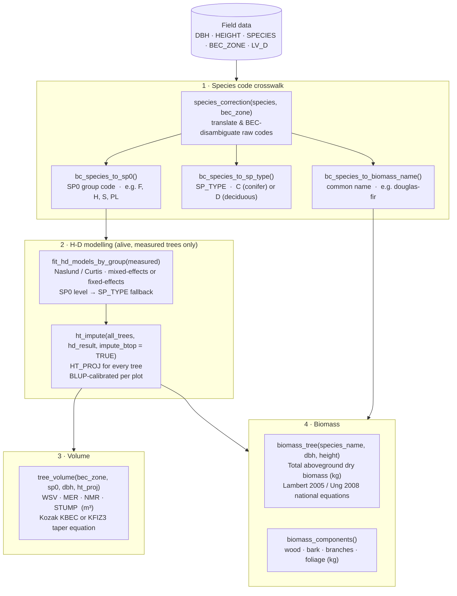

# BCallometryRCFS

An R package for tree-level calculation of H-D relationships and height
imputation, stem volume, and above-ground biomass, with an emphasis on
compatibility with BC Ministry of Forests' PSP and non-PSP field data.

Many of the package's functions were designed to replicate the BC Forest
Analysis and Inventory Branch's (FAIB) compilation routines for PSP and
non-PSP data, found in FAIBCompiler and FAIBBase. The current package
attempts to improve on the existing functions by (1) making them more
accessible through simplified functions and comprehensive vignettes,
(2) giving the user greater control over key decisions (e.g. model form
selection, broken-top tree handling, mixed- vs. fixed-effects fitting), and
(3) improving documentation.

## Installation

```r
# Install from GitHub
remotes::install_github("your-org/BCallometryRCFS")
```

## Data pipeline

The diagram below shows the end-to-end workflow from raw field data to
estimated heights, volumes, and biomass.



> **Notes**
> - Dead trees (`LV_D == "D"`) and broken-top trees (`BTOP == TRUE`) are
>   excluded from H-D model training but flow through to volume and biomass.
> - `impute_btop = TRUE` estimates total height for broken-top trees from DBH,
>   matching the BC MoF compilation routine.
> - Use `taper_eq = "KFIZ3"` with FIZ zone codes for pre-BEC inventory data.

## Quick start

```r
library(BCallometryRCFS)

trees <- psp_trees

# 1. Species crosswalk
trees$SPECIES_CORR    <- species_correction(trees$SPECIES, trees$BEC_ZONE)
trees$SPECIES_SP0     <- bc_species_to_sp0(trees$SPECIES_CORR)
trees$SPECIES_SP_TYPE <- bc_species_to_sp_type(trees$SPECIES_CORR)
trees$SPECIES_NAME    <- bc_species_to_biomass_name(trees$SPECIES, trees$BEC_ZONE)

# 2. Fit H-D models and impute heights
measured  <- trees[!is.na(trees$HEIGHT) & trees$LV_D == "L" & !trees$BTOP, ]
hd_result <- fit_hd_models_by_group(measured)
trees     <- ht_impute(trees, hd_result, impute_btop = TRUE)

# 3. Volume
trees$WSV_M3 <- tree_volume(trees$BEC_ZONE, trees$SPECIES_SP0,
                             trees$DBH, trees$HT_PROJ)

# 4. Biomass
trees$BIOMASS_KG <- biomass_tree(trees$SPECIES_NAME, trees$DBH,
                                  height = trees$HT_PROJ)
```

## Vignettes

| Vignette | Topic |
|---|---|
| `vignette("full_psp_workflow")` | End-to-end PSP workflow |
| `vignette("hd_psp_workflow")` | H-D modelling in depth |
| `vignette("biomass_psp_workflow")` | Biomass equations |
| `vignette("volume_psp_workflow")` | Kozak taper volume |

## Citation

```r
citation("BCallometryRCFS")
```

## Acknowledgements

The allometric methods implemented in this package build on the work of
**Yong Luo** (BC Ministry of Forests) and the
[FAIBBase](https://github.com/bcgov/FAIBBase) and
[FAIBCompiler](https://github.com/bcgov/FAIBCompiler) packages.

## License

© His Majesty the King in Right of Canada, as represented by the Minister of
Natural Resources, 2026.

This package is distributed under the [Apache License 2.0](LICENSE).
